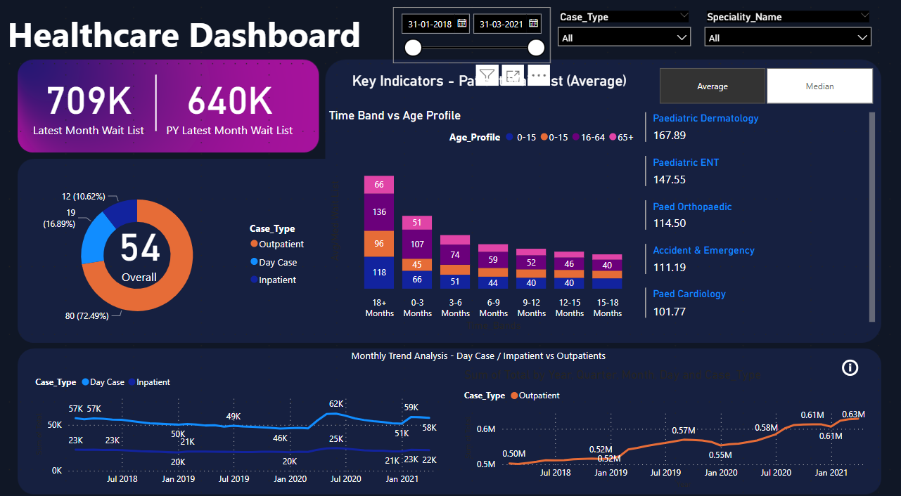

# PBI-Healthcare-Dashboard

This repository contains the source code and documentation for the Healthcare Dashboard project.

## Dashboard Preview

The above image provides a sneak peek into the healthcare dashboard. For the interactive version, please refer to the deployed dashboard.

## Introduction

This project aims to create a healthcare dashboard that provides insights into relevant data for stakeholders. The dashboard is designed to meet business objectives and deliver key performance indicators (KPIs) within a specified timeline.

## Project Process

### 1. Requirement Gathering
- Identify stakeholders
- Understand Business Objectives
  - Project Goals
  - Data Scope
  - Metrics Required
  - Views Required
- High-Level Data Study
- Define Scope (KPI, Timeline, Expectations)

### 2. Data Collection

### 3. Transformation and Modelling

### 4. Data Visualization Blueprint

### 5. Dashboard Layout and Design

### 6. Interactivity and Navigation

### 7. Testing

### 8. Sharing

### 9. Maintenance and Refresh

